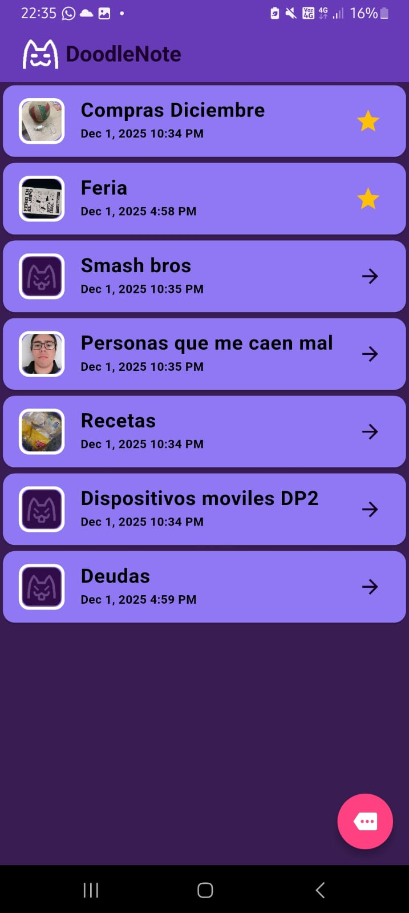
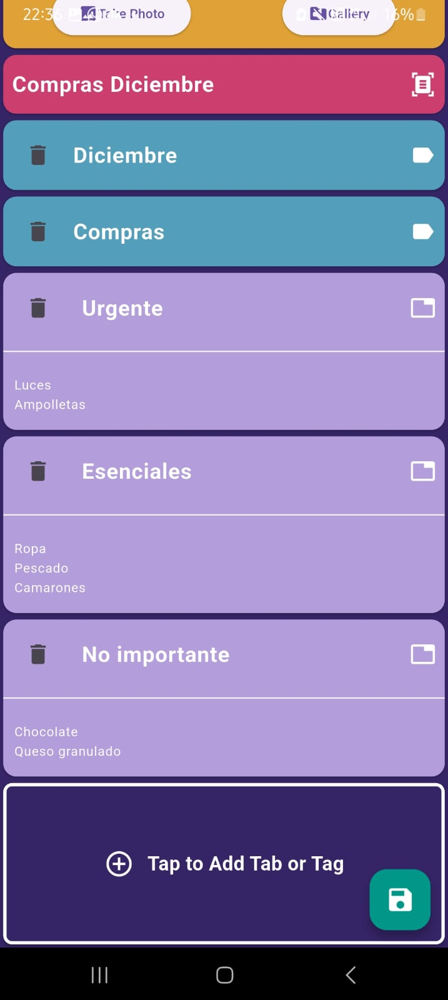
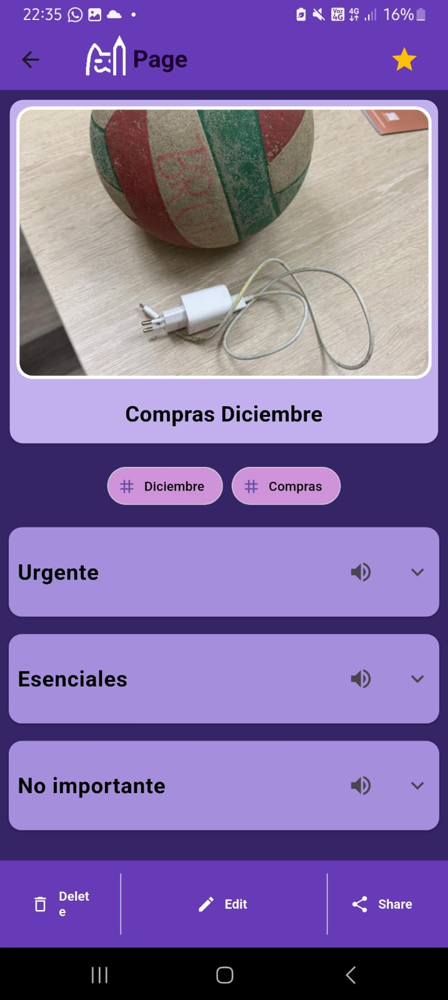
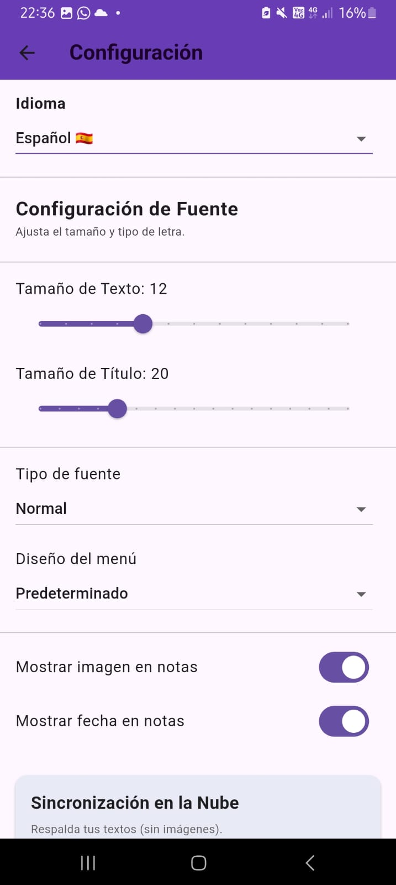
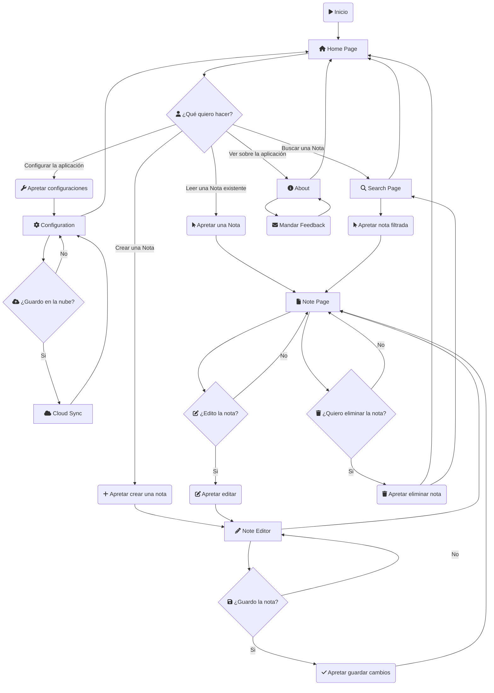

# DoodleNote

**"DoodleNote, the app where you write down on notes, the doodles of your thoughts"**

DoodleNote es una aplicacion de notas, movil, la cual tiene como objetivo el poder facilitar la organizacion y la perzonalizacion de estas.

Como mayor atractivo tiene el poder estructurar la nota mediante pestañas, partiendo la informacion necesaria. Aparte de eso permite la inclusion de Tags, los cuales permiten identificar las notas de manera rapida. Por ultimo tambien esta la capacidad de añadir una imagen a la nota de por si.

**AVISO**: Esta aplicacion esta hecha para dispositivos Android.

## Caracteristicas y Funcionalidades

- Habilidad de crear, editar, guardar y eliminar.
- El usuario puede crear secciones dentro de la nota mediante pestañas, permitiendo un mayor control e informacion en este.
- Habilidad de crear etiquetas, o *tags*, que permiten mayor perzonalizacion/filtracion.
- Poder asignar un icono/imagen a la nota. Desde la camara o el album de fotos.
- Pagina de busqueda para filtrar notas.
- Modo de Lectura de la nota.
- Modo de edicion de la nota.
- Funcionalidad de STT y TTS (Speech to Text y Text to Speech).
- Configuracion a aspectos sobre la presentacion de la aplicacion.
- Posibilidad de enviar Feedback al desarrollador
- Asignar notas como favoritas, permitiendo una mejor accesibilidad e informacion
- Poder guardar todas las notas de manera remota y crear un respaldo en la nube.
- **AVISO**: Las imagenes que hay en las notas no se guardan en la nube.

## Capturas de pantalla

    
    
    
    

# Pila de Tecnología

Este proyecto está construido principalmente con **Flutter** y utiliza **Firebase** como su backend principal, complementado con una variedad de paquetes para una experiencia de usuario rica y funcional.

## Dependencias Clave 
| Tecnología | Descripción |
| :--- | :--- |
| **Flutter SDK** | Framework principal para el desarrollo de aplicaciones móviles, web y de escritorio. |
| **Firebase** | Plataforma Backend as a Service (BaaS) para autenticación y base de datos en tiempo real. |

---

## Componentes y Paquetes

Los paquetes están agrupados por su funcionalidad principal para facilitar la comprensión.

### UI, Estilo y Utilidades Básicas
| Paquete | Funcionalidad |
| :--- | :--- |
| `flutter_speed_dial` | Botón de acción flotante (FAB) con sub-opciones. |
| `logger` | Herramienta avanzada para el logging y depuración. |
| `flutter_lints` | Conjunto de reglas de linting para mantener la calidad del código. |
| `flutter_localization` | Soporte para la internacionalización (i18n). |

### Backend y Servicios en la Nube
| Paquete | Funcionalidad |
| :--- | :--- |
| **`firebase_core`** | Inicialización del SDK de Firebase. |
| **`firebase_auth`** | Manejo de autenticación de usuarios. |
| **`cloud_firestore`** | Base de datos NoSQL en tiempo real para almacenamiento de datos. |
| `google_sign_in` | Integración de inicio de sesión con Google. |
| `flutter_dotenv` | Gestión de variables de entorno (claves de API, etc.). |

### Almacenamiento Local y Estado
| Paquete | Funcionalidad |
| :--- | :--- |
| `provider` | Gestión de estado para una arquitectura escalable. |
| `shared_preferences` | Almacenamiento simple de datos clave-valor localmente. |
| `path_provider` | Localización de rutas de directorios del sistema (archivos, caché). |
| `path` | Utilidades para trabajar con rutas de archivos y directorios. |

### Multimedia y Permisos
| Paquete | Funcionalidad |
| :--- | :--- |
| `image_picker` | Selector de imágenes y videos desde la galería o cámara. |
| `permission_handler` | Manejo de permisos de la aplicación (cámara, almacenamiento, etc.). |
| `image_gallery_saver_plus` | Guardar imágenes y videos en la galería del dispositivo. |
| **`speech_to_text`** | Reconocimiento de voz (Speech-to-Text). |
| **`flutter_tts`** | Texto a voz (Text-to-Speech) para lectura auditiva. |

### Interacción del Sistema y Distribución
| Paquete                            | Funcionalidad                                            |
| :--------------------------------- | :------------------------------------------------------- |
| `url_launcher`                     | Apertura de URLs externas (navegador, correo, teléfono). |
| `share_plus`                       | Compartir contenido con otras aplicaciones.              |
| `internet_connection_checker_plus` | Verificación del estado de la conexión a internet.       |

### Paquetes de uso momentaneo
| Paquete | Funcionalidad |
| :--- | :--- |
| `flutter_launcher_icons` | Generación de íconos de aplicación nativos. |
| `flutter_native_splash` | Creación de pantallas de bienvenida nativas. |
| `change_app_package_name` | Utilidad para cambiar el nombre del paquete/ID de la aplicación. |

---

## Diagrama de Flujo

## Links
[Link al video](https://www.youtube.com/watch?v=6gsIulRImOo)

[Descargar APK](https://drive.google.com/drive/folders/1dCXJV_R9-zCJJeZi4rBgyQ0YPDKJ5xcP)
