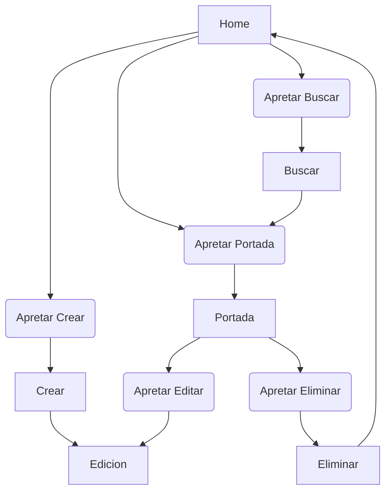

# DoodleNote

DoodleNote es una aplicacion desarollada en Flutter, la cual tiene como objetivo el poder almacenar informacion, imagenes, ademas de poder organizarlas

- A brief description of what this project does and who it's for

## Caracteristicas

#### Caracteristicas Funcionales
- El programa permite al usuario poder crear bloques de not
- El usuario puede crear en la aplicacion pestañas para poder seccionar partes del texto
- Permite al usuario ingresar imagenes
- Permite al usuario poner tags para que sea mas 

#### Caracteristicas NO Funcionales
- Poder Customizar 

## Pila de Tecnologia
SDK de Flutter

//HACER COMMIT

