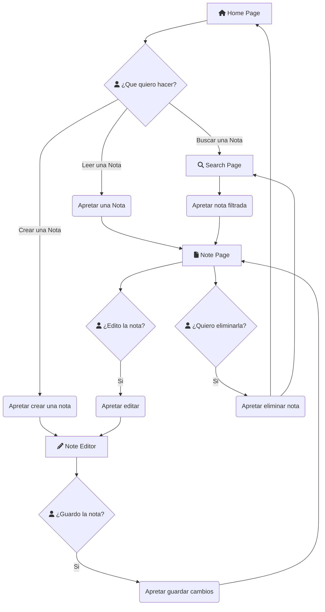

# DoodleNote

"DoodleNote, the app where you write down on notes, the doodles of your thoughts"

DoodleNote es una aplicacion de notas, movil, la cual tiene como objetivo el poder facilitar la organizacion y la perzonalizacion de estas.

Como mayor atractivo tiene el poder estructurar la nota mediante pestañas, partiendo la informacion necesaria. Aparte de eso permite la inclusion de Tags, los cuales permiten identificar las notas de manera rapida. Por ultimo tambien esta la capacidad de añadir una imagen a la nota de por si.
## Caracteristicas

- Habilidad de editar, guardar y crear notas de texto.
- El usuario puede crear secciones dentro de la nota mediante pestañas, permitiendo un mayor control e informacion en este.
- Habilidad de crear etiquetas, o *tags*, que permiten mayor perzonalizacion/filtracion.
- Poder asignar un icono/imagen a la nota. Desde la camara o el album de fotos.
- Pagina de busqueda para filtrar notas.
- Modo de Lectura de la nota.
- Modo de edicion de la nota.
## Pila de Tecnologia

- SDK de flutter
- flutter_lints
- logger
- cupertino_icons
- flutter_launcher_icons: 
- flutter_native_splash

## Diagrama de Flujo

